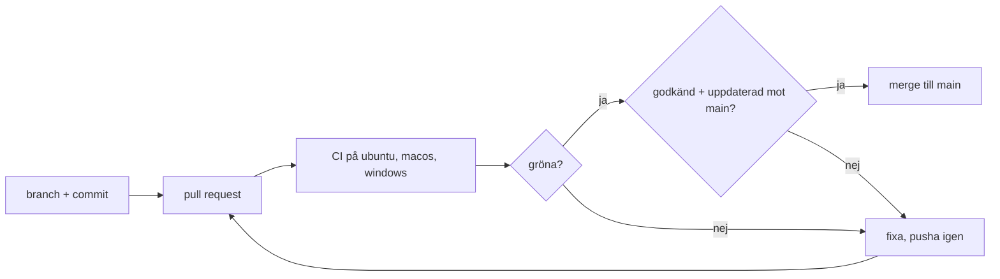

# Pipeline

## Flöde



## Steg och tider

Tid per steg och operativsystem i sekunder.

- Ubuntu: 25 sekunder
- macOS: 26 sekunder
- Windows: 49 sekunder

### `npm ci`

Fångar package-lock.json som inte stämmer med package.json.

- Tid på ubuntu: 10 sekunder
- Tid på macos: 11 sekunder
- Tid på windows: 19 sekunder

### `biome ci`

Fångar lintfel, varningar, felformatering, osorterat.

- Tid på ubuntu: 1 sekund
- Tid på macos: 1 sekund
- Tid på windows: 1 sekund

### `npm run lint:md`

Fångar trasig markdown i dokumenten.

- Tid på ubuntu: 0 sekunder
- Tid på macos: 1 sekund
- Tid på windows: 1 sekund

### `npm run lint:spelling`

Fångar stavfel i .js, .jsx och .md.

- Tid på ubuntu: 2 sekunder
- Tid på macos: 2 sekunder
- Tid på windows: 4 sekunder

### `npm test`

Fångar att testerna körs (ett röktest än så länge).

- Tid på ubuntu: 2 sekunder
- Tid på macos: 1 sekund
- Tid på windows: 2 sekunder

### `npm run build`

Fångar fel som bara syns när klienten byggs.

- Tid på ubuntu: 0 sekunder
- Tid på macos: 1 sekund
- Tid på windows: 2 sekunder

## Regler på main

- PR krävs, minst en godkännare och "gröna checks" från alla tre operativsystemen
- Branchen måste vara uppdaterad mot main innan merge
- Reglerna gäller även admins

## Kommandon

```sh
npm run lint
npm run lint:md
npm run lint:spelling
npm test
npm run build
```
